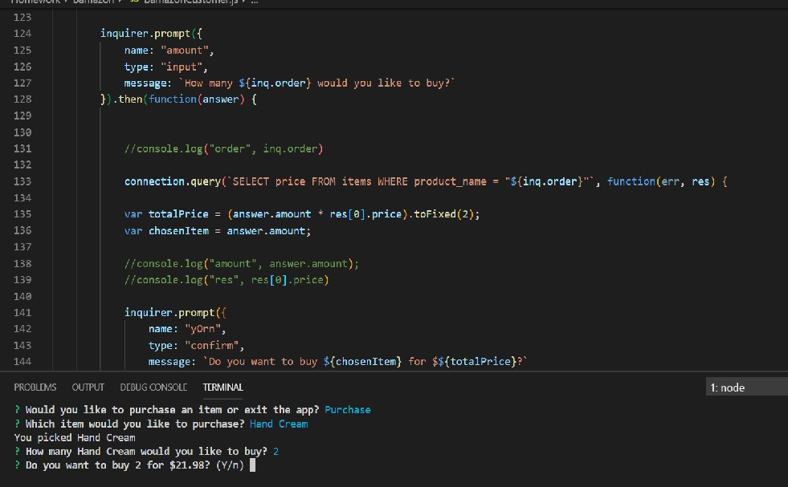
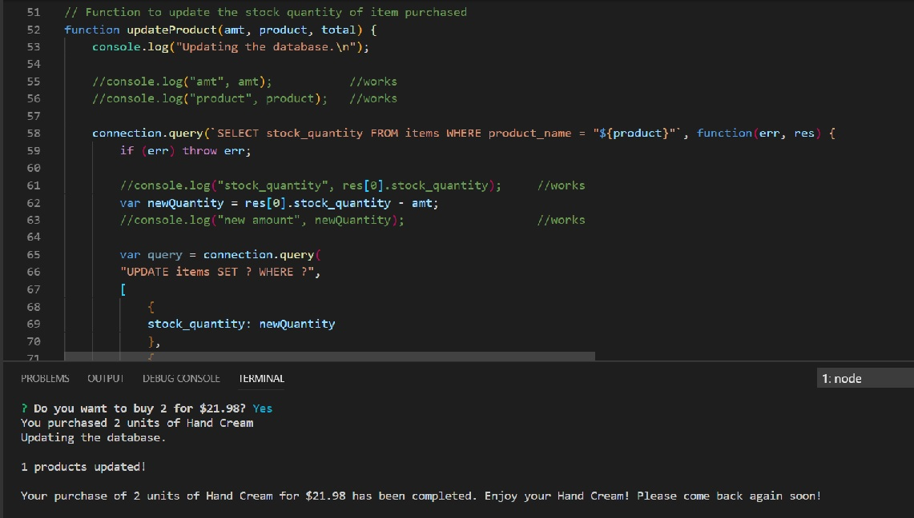

# Bamazon
Bamazon

Overview:
In this activity, I created an Amazon-like storefront using the MySQL server I learned this unit. The app takes in orders from customers and depletes stock from the store's inventory accordingly. As a bonus task, I programed my app to track product sales across my store's departments and then provided a summary of the highest-grossing departments in the store.

npm packages used: inquirer, mysql

Screenshots:
;
;
;
;
;

